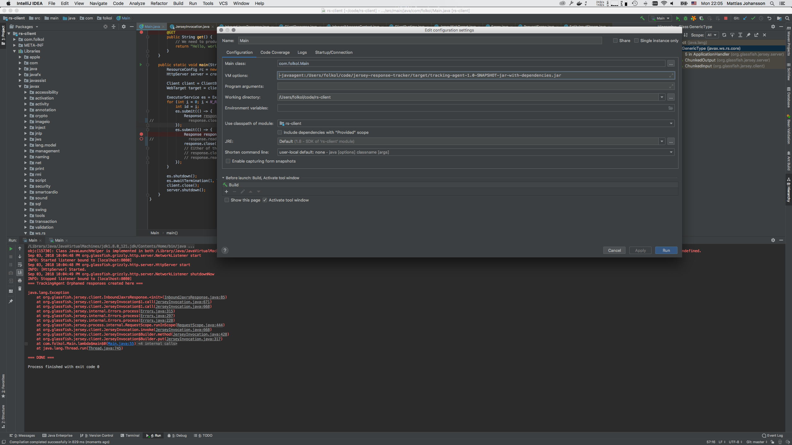

# Jersey Response Tracker

This _Java Agent_ attempts to track orphaned Jersey Response objects by adding all new `InboundJaxrsResponse` objects to a global map, removing them on `close`/`readEntity` -- and printing what's left in the map from a _JVM ShutdownHook_.

## Build

```
$ mvn clean package
```

## Run

